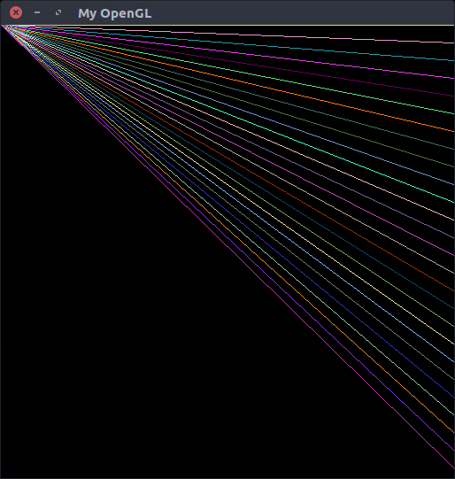
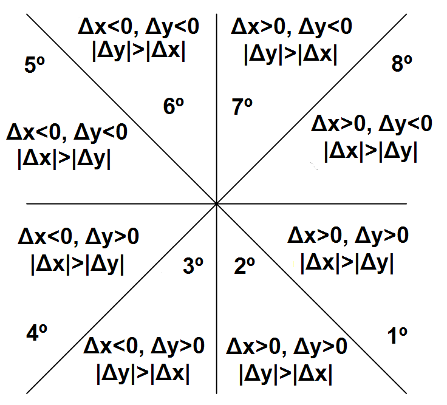
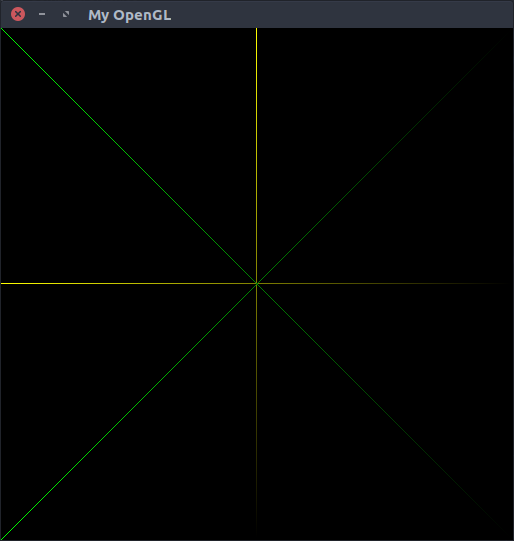
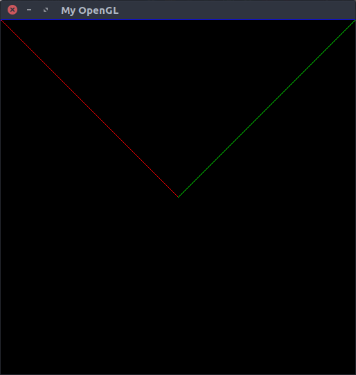
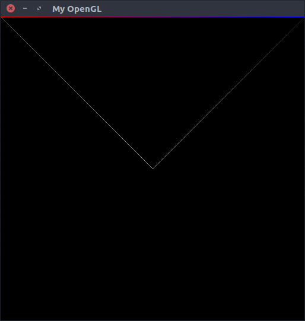

# TI-1
Algoritmos de rasterização

## Menu

* [Introdução](#introdução)
* [Rasterização de pontos](#rasterização-de-pontos)
* [Rasterização de retas](#rasterização-de-retas)
* [Desenho de triângulos](#desenho-de-triângulos)
* [Referências](#referências)

---

## Introdução

O objetivo do projeto consiste na implementação de algoritmos para a renderização de pontos e linhas. O projeto está escrito
na linguagem C++ e todo o seu código fonte pode ser encontrado na pasta TI-1 deste repositório.

---

### Rasterização de pontos

A rasterização é o processo de "escrever imagens" na tela, ou seja, é a transição da imagem do meio virtual para a sua
representação visual através do display de vídeo. Para realizar está operação deve-se ativar os pixels do display com cores
específicas com o intuito de formar imagens. Os pixels são representados em uma malha - **Figura 1** - ```X x Y``` onde ```X``` é a largura da tela e ```Y``` é a altura da mesma - em uma tela Full HD existem ```1920x1080 pixels```.
<p align="center">
	<br>
	
	<h5 align="center">Figura 1 - Imagem retirada dos slides da aula 2 - Rasterization</h5>
	<br>
</p>

Para identificar o local correto de desenhar o pixel, deve-se calcular o offset do mesmo com base na dimensão da janela. A posição retornada pelo offset será o primeiro byte onde o pixel está definido. O método que encontra tal posição pode ser visto a seguir:

``` C++
int Pixel::initialPosition() {
    return (x + (y * IMAGE_WIDTH)) * 4;
}
```

Na função acima pode-se verificar o seguinte:

1. x é a posição onde o pixel estará em relação a largura da tela;
2. y é a posição onde o pixel estará em relação a altura da tela;
3. IMAGE_WIDTH é a largura da tela.

Mas o que é 4? 4 define o tamanho de um pixel. Cada pixel da aplicação segue o formato RGBA, ou seja, a mesma utiliza quatro canais para representar a cor.

1. R - Canal Vermelho - Red;
2. G - Canal Verde - Green;
3. B - Canal Azul - Blue;
4. A - Canal Alpha - Transparência

Cada canal possui um byte - 256 combinações por canal -  responsável por armazenar a sua informação. Logo, podemos compreender que ```1R + 1B + 1G + 1A = 4 bytes```.

Sabendo destas informações foi implementada a primeira técnica de rasterização, desenhar um pixel na tela. A rasterização do ponto é implementada na função PutPixel, descrita abaixo:
``` C++
void PutPixel(Vertex vertex) {
    if (vertex.isValid())  {
        int initialPosition = vertex.initialPosition();

        for (int i = 0; i < 4; i++) {
            FBptr[initialPosition++] = vertex.color.rgba[i];
        }
    } else {
        std::cerr << "Coordinates " << vertex.x << " and " << vertex.y << " are out of bounds\n";
    }
}
```

Para validar a função PutPixel, foi definida a função DrawCanvas que utiliza a mesma para desenhar borda e pixels espaçados na tela. A função pode ser vista abaixo, já o desenho pode ser visto na **Figura 2**.
``` C++
void DrawCanvas(int vertexSpread) {
    int initialCrosshair = IMAGE_WIDTH/2 - 50;
    int finalCrosshair   = IMAGE_WIDTH/2 + 50;

    for (int i = 0; i < IMAGE_WIDTH; i++) {
		PutPixel(Vertex(i, 0, Color(0 ,255,0 ,255)));
		PutPixel(Vertex(i, IMAGE_HEIGHT-1, Color(0 ,255,0 ,255)));
		PutPixel(Vertex(i, IMAGE_HEIGHT/2, (i % vertexSpread == 0 ? (i > initialCrosshair && i < finalCrosshair ? Color(255, 0 ,0 ,255) :  Color(255, 255, 0, 255)) : Color())));
	}
	for (int i = 1; i < IMAGE_HEIGHT - 1; i++) {
		PutPixel(Vertex(IMAGE_HEIGHT-1, i, Color(0 ,255,0 ,255)));
		PutPixel(Vertex(0, i, Color(0 ,255,0 ,255)));
		PutPixel(Vertex(IMAGE_WIDTH/2, i,  (i % vertexSpread == 0 ? (i > initialCrosshair && i < finalCrosshair ? Color(255, 0 ,0 ,255) :  Color(255, 255, 0, 255)) : Color())));
	}
}
```

<p align="center">
	<br>
	
	<h5 align="center">Figura 2 - Validação da função PutPixel</h5>
	<br>
</p>

### Rasterização de retas

A rasterizaço de retas consiste em gerar pixels da forma mais ordenada possível com o intuito de gerar uma reta. Para alcançar tal objetivo foi utilizado o algoritmo de Bresenham que pode ser visto abaixo.

```C++
void DrawLine(Vertex initialVertex, Vertex finalVertex) {
    int xDistance    = finalVertex.x - initialVertex.x;
    int yDistance    = finalVertex.y - initialVertex.y;

    int currentY     = initialVertex.y;
    int baseDistance = (yDistance << 1) - xDistance;

    int eIncrement   = (yDistance << 1);
    int seIncrement  = (yDistance - xDistance) << 1;

    PutPixel(Vertex(initialVertex.x, currentY, initialVertex.color));

    for (int currentX = initialVertex.x + 1; currentX <= finalVertex.x; currentX++) {
        if (baseDistance <= 0) {
            baseDistance += eIncrement;
        } else {
            currentY++;
            baseDistance += seIncrement;
        }
        PutPixel(Vertex(currentX, currentY, initialVertex.color));
    }
}
```

Porém, o algoritmo acima só desenha linhas para o primeiro octante, ou seja, retas que se encontram entre 0º e 45º.
Para melhor exemplificar uma captura de tela do algoritmo acima sendo executado pode ser vista abaixo.

<p align="center">
	<br>
	
	<h5 align="center">Figura 3 - DrawLine para o primeiro octante</h5>
	<br>
</p>

Para generalizar o algoritmo deve-se;

* Calcular a variação do ponto de origem para o ponto de destino da reta.
* Examinar tal variação para que se possa indicar se devemos incrementar ou decrementar coordenadas para desenhar a reta.
* Verificar a variação para que, se necessário, haja a troca dos componentes x, y.
* Verificar as coordenadas para trocar os planos

Para verificar as expressões condicionais é interessante seguir a seguinte tabela que exemplifica a posição da reta.

<p align="center">
	<br>
	
	<h5 align="center">Figura 4 - Representação de Bresenham nos octantes</h5>
	<br>
</p>

Como resultado temos:

<p align="center">
	<br>
	
	<h5 align="center">Figura 5 - Bresenham generalizado</h5>
	<br>
</p>

### Desenho de triângulos

Após solucionar a generalização do algoritmo de Bresenham a rasterização de triângulos se torma trivial. Só precisamos desenhar as três linhas conectados aos vértices solicitado.

```C++
void DrawTriangle(Vertex fVertex, Vertex sVertex, Vertex tVertex) {
    DrawLine(fVertex, sVertex);
    DrawLine(sVertex, tVertex);
    DrawLine(tVertex, fVertex);
}
```
<p align="center">
	<br>
	
	<h5 align="center">Figura 6 -Linhas interpoladas</h5>
	<br>
</p>

### Interpolação de cores

Para concluir, foi adicionado ao algoritmo de linha a funcionalidade de interpolação de cores. Para realizar uma mudança gradual foi calculada a variação entre a cor inicial e final sobre os pixels da reta x. ```VARIACAO = (COR_INICIA - COR_FINAL) / QTDE_DE_PIXELS```

Sabendo de tal variação devemos incrementar o valor de cada novo pixel a este valor. O resultado é o seguinte:

<p align="center">
	<br>
	
	<h5 align="center">Figura 7 - Rasterização de triângulos</h5>
	<br>
</p>
### Referências

* [https://www.cs.helsinki.fi/group/goa/mallinnus/lines/bresenh.html](https://www.cs.helsinki.fi/group/goa/mallinnus/lines/bresenh.html)
