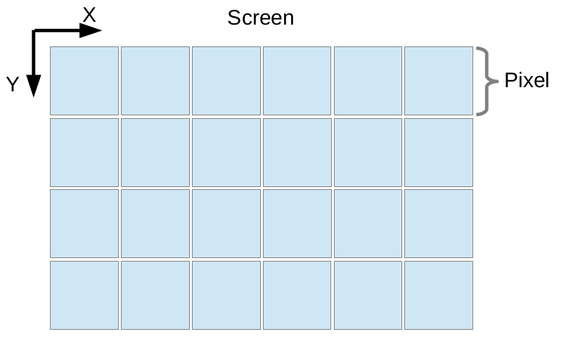

# TI-1
Algoritmos de rasterização

---

## Introdução

O objetivo do projeto consiste na implementação de algoritmos para a renderização de pontos e linhas. O projeto está escrito
na linguagem C++ e todo o seu código fonte pode ser encontrado na pasta TI-1 deste repositório.

---

### Rasterização de pontos

A rasterização é o processo de "escrever imagens" na tela, ou seja, é a transição da imagem do meio virtual para a sua
representação visual através do display de vídeo. Para realizar está operação devemos ativar os pixels do display com cores
específicas com o intuito de formar imagens. Os pixels são representados em uma malha - **Figura 1** - ```X x Y``` onde ```X``` é a largura da tela e ```Y``` é a altura da mesma - em uma tela Full HD existem ```1920x1080 pixels```.
<p align="center">
	<br>
	
	<h5 align="center">Figura 1 - Imagem retirada dos slides da aula 2 - Rasterization</h5>
	<br>
</p>

Para sabermos o local correto de desenhar o pixel, devemos calcular o offset do mesmo com base na dimensão da janela. A posição retornada pelo offset será o primeiro byte onde o pixel está definido. O método que encontra tal posição pode ser visto a seguir:

``` C++
int Pixel::initialPosition(const int screenWidth) {
    return (x + (y * screenWidth)) * 4;
}
```

Na função acima podemos verificar o seguinte:

1. x é a posição onde o pixel estará em relação a largura da tela;
2. y é a posição onde o pixel estará em relação a altura da tela;
3. screenWidth é a largura da tela.

Mas o que é 4? 4 define o tamanho de um pixel. Cada pixel da aplicação segue o formato RGBA, ou seja, a mesma utiliza quatro canais para representar a cor.

1. R - Canal Vermelho - Red;
2. G - Canal Verde - Green;
3. B - Canal Azul - Blue;
4. A - Canal Alpha - Transparência

Cada canal possui um byte - 256 combinações por canal -  responsável por armazenar a sua informação. Logo, podemos compreender que ```1R + 1B + 1G + 1A = 4 bytes```.
