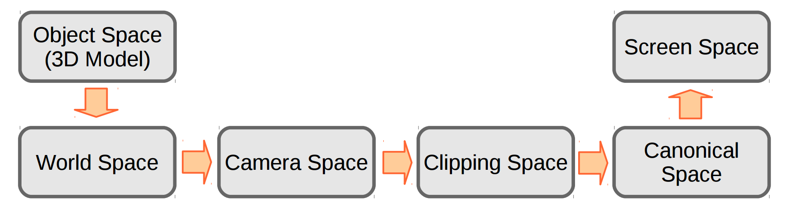
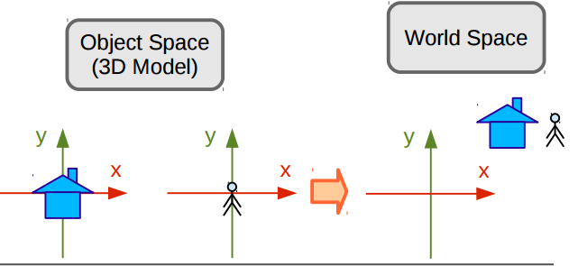
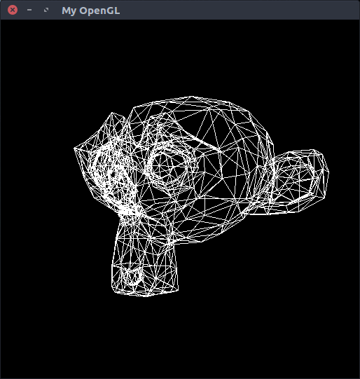
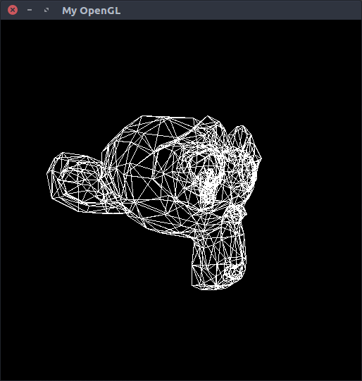

# TI-2
Pipeline Gráfico

## Menu

* [Introdução](#introdução)
* [Etapas do pipeline](#etapas-do-pipeline)
* [Resultados](#resultados)
---

## Introdução

O objetivo do projeto consiste na implementação de um pipeline gráfico completo. O projeto está escrito
na linguagem C++ e todo o seu código fonte pode ser encontrado na pasta TI-2 deste repositório.

O pipeline é uma série de passos que devem ser tomados para que uma cena possa ser levada do espaço 
do ```objeto``` para o espaço da ```tela```. Abaixo veremos todas as etapas do pipeline.

<p align="center">
	<br>
	
	<h5 align="center">Figura 1 - Imagem retirada dos slides da aula 5 - Introduction to the Graphics Pipeline</h5>
	<br>
</p>

---

### Etapas do pipeline

#### Espaço do objeto para o espaço do universo

<p align="center">
	<br>
	
	<h5 align="center">Figura 2 - Imagem retirada dos slides da aula 8 - Modeling and View Transform</h5>
	<br>
</p>

A primeira etapa do pipeline leva os objetos para o universo da cena, para tal
são usadas operações elementares que podem ser representadas como matrizes, dentre
estas operações podemos citar: escala, shear, translação e rotação. Portanto, ao 
aplicarmos estas operações em nosso objeto, colocamos o mesmo em função do eixo que 
representa o universo. A união de n matrizes distintas é denominada matriz model.

Para criar a matriz model - união das matrizes que irão afetar os objetos - foram implementandos três métodos
no objeto responsável pelo pipeline. São eles: 

```C++
void Pipeline::setRotation(float angle, float x, float y, float z) {
    matrixModel = glm::rotate(matrixModel, angle, glm::vec3(x, y, z));
}
```

```C++
void Pipeline::setTranslation(float x, float y, float z) {
    matrixModel =  glm::translate(matrixModel, glm::vec3(x, y, z));
}
```

```C++
void Pipeline::setScale(float x, float y, float z) {
    matrixModel = glm::scale(matrixModel,glm::vec3(x, y, z));
}
```


A chamada desses métodos afeta a model, seja escalando, rotacionando ou transladando os objetos da cena. No passo 
final da criação do pipeline está matriz será multiplicada pelas matrizes, view e transform.

#### Espaço do universo para o espaço da câmera

<p align="center">
	<br>
	
	<h5 align="center">Figura 3 - Imagem retirada dos slides da aula 8 - Modeling and View Transform</h5>
	<br>
</p>

Nesta etapa é definida a forma como a cena é vista pelo usuário, para tal, definimos o eixo
onde a câmera está posicionada. O mesmo é dado por:

* Camera Position: A posição da câmera no espaço do universo;
* View Direction: A direção aonde a câmera está olhando;
* Up Vector: Fixa a camêra em determinado eixo.

Abaixo podemos ver toda a criação da câmera - matriz view.

```C++
glm::mat4 Pipeline::createMatrixView(const float zDistance) {
    glm::vec3 cameraPosition(0.0f, 0.0f, zDistance);
    glm::vec3 viewDirection(0.0f, 0.0f, 0.0f);
    glm::vec3 upVector(0.0f, 1.0f, 0.0f);

    glm::vec3 Zc = glm::normalize(cameraPosition - viewDirection);
    glm::vec3 Xc = glm::normalize(glm::cross(upVector, Zc));
    glm::vec3 Yc = glm::normalize(glm::cross(Zc, Xc));

    glm::mat4 B = glm::mat4(1.0f);
    B[0] = glm::vec4(Xc, 0.0f);
    B[1] = glm::vec4(Yc, 0.0f);
    B[2] = glm::vec4(Zc, 0.0f);

    glm::mat4 T = glm::mat4(1.0f);
    T[3] = glm::vec4(-cameraPosition, 1.0f);

    return glm::transpose(B) * T;
}

```


#### Espaço da câmera para o espaço de recorte

Utilizando a matriz projection movemos todos os pontos do espaço da câmera
para o espaço de recorte. Um ponto a ser ressaltado é o fato de que além da 
passagem de um espaço para outro está matriz também realiza a distorção perpectiva
na cena - obejetos mais próximos do view plane ficam maiores do que os que estão
mais distantes. 

```C++
glm::mat4 Pipeline::createMatrixProjection(const float viewPlaneDistance) {
    glm::mat4 matrixProjection = glm::mat4(1.0f);
    matrixProjection[2].w = -1 / viewPlaneDistance;
    matrixProjection[3].z = viewPlaneDistance;
    return matrixProjection;
}
```

#### Espaço de recorte para o espaço canônico

O processo de mover os vértices para o espaço de canônico chama-se homogeneização.
A mesma consiste em dividir todos os componentes do vértice pela sua coordenada
homogênea. O método Pipeline::toScreenSpace(...) faz tanto a homogienização quanto
a passagem para o espaço da tela.

```C++
void Pipeline::toScreenSpace(glm::mat4& modelViewProjection, glm::vec4& firstVertex, glm::vec4& secondVertex, glm::vec4& thirdVertex) {
    glm::mat4 invert;
    invert[1].y = -1;

    glm::mat4 translate(1.0f);
    translate[3] = glm::vec4(1.0f, 1.0f, 0.0f, 1.0f);

    glm::mat4 scale(1.0f);
    scale[0].x = (IMAGE_WIDTH-1) * 0.5f;
    scale[1].y = (IMAGE_HEIGHT-1) * 0.5f;

    glm::mat4 screenMatrix = scale * translate * invert;

    firstVertex = modelViewProjection * firstVertex;
    secondVertex = modelViewProjection * secondVertex;
    thirdVertex = modelViewProjection * thirdVertex;

    firstVertex = screenMatrix * firstVertex / firstVertex.w;
    secondVertex = screenMatrix * secondVertex / secondVertex.w;
    thirdVertex = screenMatrix * thirdVertex / thirdVertex.w;
}
```
#### Espaço canônico para o espaço da tela

A etapa final é preparar os vértices para a exibição da tela, fazemos as alterações finais ao multiplicarmos os vértices pela matriz viewport - na implementação screenMatrix. A viewport consiste em uma matriz composta de duas escalas e uma translação. Tais matrizes podem ser vistas a seguir:

```C++
void Pipeline::toScreenSpace(glm::mat4& modelViewProjection, glm::vec4& firstVertex, glm::vec4& secondVertex, glm::vec4& thirdVertex) {
    glm::mat4 invert;
    invert[1].y = -1;

    glm::mat4 translate(1.0f);
    translate[3] = glm::vec4(1.0f, 1.0f, 0.0f, 1.0f);

    glm::mat4 scale(1.0f);
    scale[0].x = (IMAGE_WIDTH-1) * 0.5f;
    scale[1].y = (IMAGE_HEIGHT-1) * 0.5f;

    glm::mat4 screenMatrix = scale * translate * invert;

    firstVertex = modelViewProjection * firstVertex;
    secondVertex = modelViewProjection * secondVertex;
    thirdVertex = modelViewProjection * thirdVertex;

    firstVertex = screenMatrix * firstVertex / firstVertex.w;
    secondVertex = screenMatrix * secondVertex / secondVertex.w;
    thirdVertex = screenMatrix * thirdVertex / thirdVertex.w;
}
```

### Resultados

Inicialmente tive dificuldade de realizar a transição para o espaço canônico, porém o problema foi sanado ao reler o material fornecido.

Abaixo seguem duas imagens, a figura 4 mostra o objeto sem a passagem pelo espaço canônico, já a figura 5 mostra o objeto com passagem completa pelo pipeline - versão final.
<p align="center">
	<br>
	
	<h5 align="center">Figura 4 - Macaco sem a passagem pelo espaço canônico</h5>
	<br>
</p>

<p align="center">
	<br>
	
	<h5 align="center">Figura 5 - Macaco com a passagem pelo espaço canônico</h5>
	<br>
</p>

### Referências
* Slides de aula
* [GLM](http://glm.g-truc.net/0.9.8/index.html)
