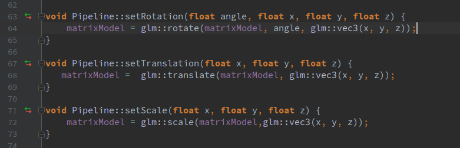
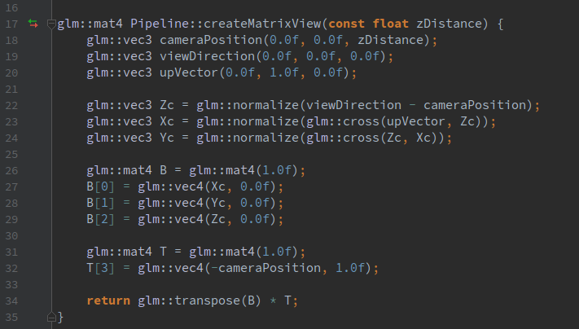
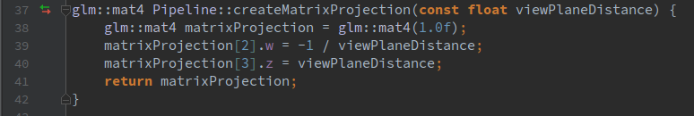

# TI-2
Pipeline Gráfico

## Menu

* [Introdução](#introdução)
* [Etapas do pipeline](#etapas-do-pipeline)

---

## Introdução

O objetivo do projeto consiste na implementação de um pipeline gráfico completo. O projeto está escrito
na linguagem C++ e todo o seu código fonte pode ser encontrado na pasta TI-2 deste repositório.

O pipeline é uma série de passos que devem ser tomados para que uma cena possa ser levada do espaço 
do ```objeto``` para o espaço da ```tela```. Abaixo veremos todas as etapas do pipeline.

<p align="center">
	<br>
	
	<h5 align="center">Figura 1 - Imagem retirada dos slides da aula 5 - Introduction to the Graphics Pipeline</h5>
	<br>
</p>

---

### Etapas do pipeline

#### Espaço do objeto para o espaço do universo

A primeira etapa do pipeline leva os objetos para o universo da cena, para tal
são usadas operações elementares que podem ser representadas como matrizes, dentre
estas operações podemos citar: escala, shear, translação e rotação. Portanto ao 
aplicarmos estas operações em nosso objeto colocamos o mesmo em função do eixo que 
representa o universo. A união de n matrizes distintas é denominada matriz model.

Para criar a matriz model - união das matrizes que irão afetar os objetos - foram implementandos três métodos
no objeto responsável pelo pipeline. São eles: 

<p align="center">
	<br>
	
	<h5 align="center">Figura 2 - Métodos que criam a matriz model.</h5>
	<br>
</p>

A chamada desses métodos afeta a model, seja escalando, rotacionando ou transladando os objetos da cena. No passo 
final da criação do pipeline está matriz será multiplicada pelas matrizes, view e transform.

#### Espaço do universo para o espaço da câmera

Nesta etapa é definida a forma como a cena é vista pelo usuário, para tal, deifinimos o eixo
onde a câmera está posicionada. O eixo é dado por:

* Camera Position: A posição da câmera no espaço do universo;
* View Direction: A direção aonde a câmera está olhando;
* Up Vector: Fixa a camêra em determinado eixo.

Abaixo podemos ver toda a criação da câmera - matriz view.

<p align="center">
	<br>
	
	<h5 align="center">Figura 3 - Métodos que criam a matriz view.</h5>
	<br>
</p>

#### Espaço da câmera para o espaço de recorte

A transição entre estes espaços aplica uma visão perspectiva da cena. A matriz utilizada considera apenas a distância da
câmera até o view plane.

<p align="center">
	<br>
	
	<h5 align="center">Figura 3 - Métodos que criam a matriz projection.</h5>
	<br>
</p>

### Referências
